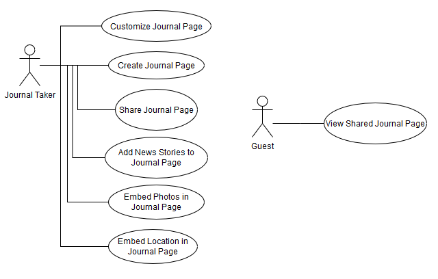
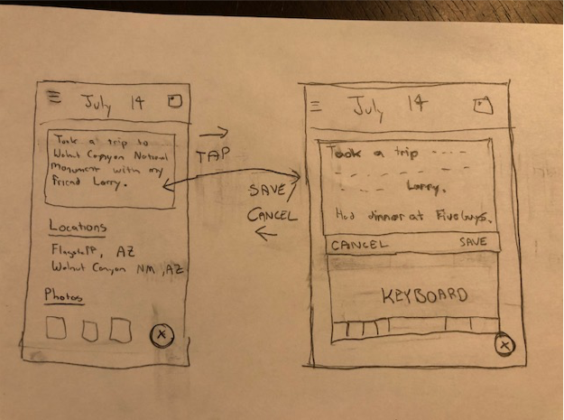
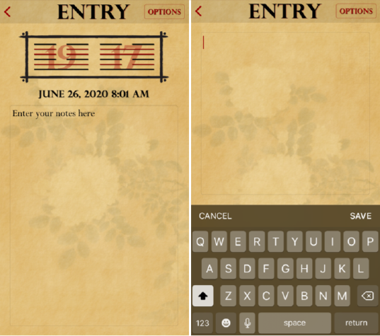
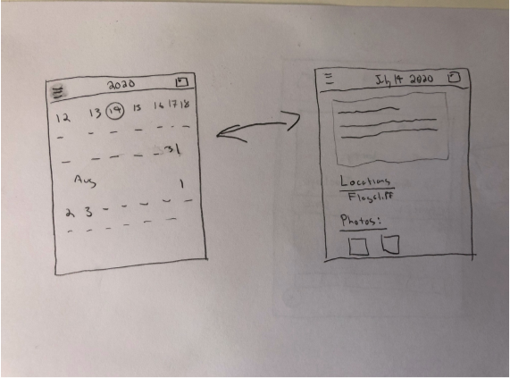
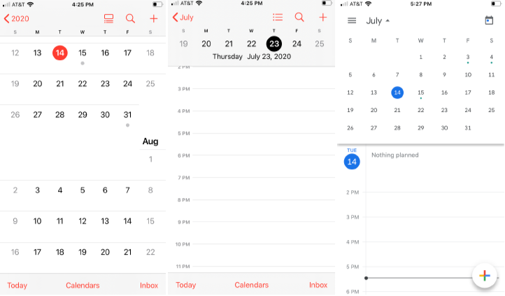
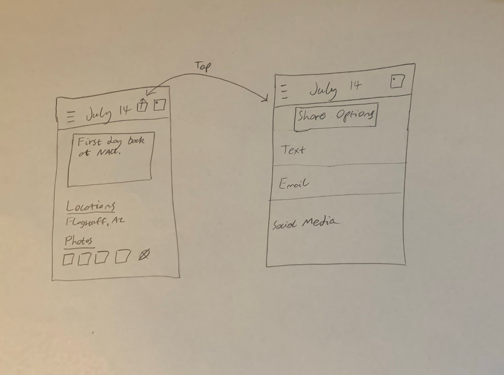

# D2. Requirements

Results of the requirements engineering for Journal Time.

## 1. Positioning

### 1.1 Problem Statement

Our memories can be greatly enhanced by including more context and information within our personal journals.  Currently, adding information beyond written entries requires significant effort by the individual, and a simple journal misses out on so much content, data, and other available information that is available on a smartphone.  

### 1.2 Product Position Statement

For people who appreciate logging experiences from their day, Journal Time is a journaling app that automatically integrates relevant information, such as photos, into entries. Unlike other journaling and note-taking applications, Journal Time takes care of integrating information into journal entries for its users.

### 1.3 Value Proposition

Journaling and diary keeping have long been used to preserve memories and recall the past.  Journal Time is mobile app that helps users create enhanced personal journal entries that better capture and preserve their most important memories.  Journal Time allows users to add customized information, such as photos, social media posts, and news stories, from their smartphone or from their internet accounts to their daily journal entries.  This information is then organized in an attractive digital layout that can be utilized and shared in different manners.  

## 2. Stakeholders

* Those who journal - People downloading Journal Time in order to keep track of their lives and integrate relevant information into their entries.  We believe that there will be initial interest from those who wish to capture the most detail about their daily lives.

* Journal app developers - People who design and create the proper specifications for the journal app. They will also test and improve the app for those who use the journal app over time.

* Other journaling and note-taking apps - We will utilize features in similar note-taking apps, such as text boxes. These apps are considered stakeholders as they will be our competitors.

## 3. Functional Requirements (features)

1. Users can enter their own text (journal) entries.

2. Users can choose which photos they would like displayed on their journal.

3. Users can choose if they want different locations they visited throughout the day displayed on their journal.

4. Users may choose whether or not to pull relevant news articles into their journal.

5. Users can choose a journal theme. (journal theme will include color and font)

6. Users may choose to share their journal with other people via email, text link or through the app.

7. Users can share their journal with others for group collaboration.

8. Users can login with and share directly to social media.

9. Users may choose to incorporate weather data into their journal.

10. Users can use their favorite streaming service to incorporate music in the journal.

11. Users can craft their journal entries with options other than text input. (stylus, voice, etc.).

## 4. Non-functional requirements

1. Security (secure storage of entries)

2. Ease of use (creating/editing entries)

3. Efficiency (quickly finding already created entries)

4. Portability (multiple device sharing)

5. Performance (ability to load journal entries within seconds)

6. Maintainability (easy to test and fix)

7. Effectiveness (will increase the retention of context and information)

## 5. MVP

To create our minimum viable product, we will begin with the basics of our app, photo and text input.  Following that, a coherent and clean user interface will begin to form from our data received from beta testing and interviewing users.  The app will move through many iterations before we find an attractive and functional look.  Features wise, we will continue to conduct studies about what potential users would like to see added to the app in the future.  As we learn from these studies, the app will morph in the direction of what the our user base envisons.

## 6. Use cases

### 6.1 Use case diagram

### 6.2 Use case descriptions

### Use-Case: Edit Journal Entry

1. **Brief Description**

   This function allows a user to edit (including a new entry) a journal entry for a specific day.

2. **Actors**

   **2.1 Journal User**

   **2.2 Back-end**

3. **Preconditions**

   The Journal User has navigated to a day page.

4. **Basic Flow of Events**

   * The use case begins when the Journal User selects a specific day's journal page.
  
   * The Journal User will see a small text box with either 1) no text if it is a previously unwritten journal or 2) the “hardcoded” text of that day’s entry that the user had previously written.

   * The user “taps” on the text box area to edit the text.

   * A keyboard will rise up from the bottom and the previously “hardcoded” text box will change to a text box that the user can edit.

   * The user will use basic texting tools to edit a journal entry.

   * The Journal User will either press “save” to accept the changes or “cancel” to cancel the edits

   * If “save” is pressed, the journal entry object is updated with the new text and provided to the Back-End.

   * The use case ends successfully.  The page reverts to the “hardcoded” text version where the new edits have been included, and user has ability to navigate throughout the app.  

5. **Alternative Flows**

   **5.1 Cancel**

   If the Journal User selects cancel: The use case ends with no changes.  The page reverts to the “hardcoded” text version with no edits being included, and user has ability to navigate throughout the app.  

   **5.2 Navigate Back / Cancel Key**

   If at any point during the editing prior to a save, if the Journal User presses the cancel key, this will act the same as pressing “cancel” where no changes are updated and the Journal User is taken back to the day’s page.

6. **Key Scenarios**

   **6.1 Journal User makes changes**

   **6.2 Journal User cancels changes**

7. **Post-conditions**

   **7.1 Successful Completion**

   The journal entry has been updated with new text or canceled.  That days journal entry reflect changes and can be viewed by the Journal User.

8. **Special Requirements**

   The basic display text box should expand for increasing amounts of text.

### Use-Case: Navigate to a Day’s Journal Page

1. **Brief Description**

   This function allows a user to navigate to any given day’s journal page.

2. **Actors**

   **2.1 Journal User**

3. **Preconditions**

   The Journal User is logged in and viewing the app in a “Calendar” view displaying a month of a year.  The default setting on opening the app takes the Journal User to the current date.  

4. **Basic Flow of Events**

   * Within the calendar view the user can navigate to a specific month within a specific year by scrolling up or down a calendar display.

   * When the Journal User gets to a day where they want to view a specific day’s journal page, they will click on that date and it will navigate to a new screen with that day’s journal entry.

   * Within a specific day’s journal page, the user can view / edit the journal page, return to the calendar view, or navigate to the proceeding or following day’s journal page by swiping left or right.

   * The use case ends successfully. The user arrives at the journal page of the desired date of choice.  

5. **Alternative Flows**

   **5.1 Choose a different view**

   The Journal User can select a different calendar view within the options tab

   **5.2 Scroll Calendar Beyond Range**

   The back-end capabilities will determine the range of the calendar dates.

6. **Key Scenarios**

   **6.1 Journal User navigates**

   **6.2 Journal User can navigate back to calendar view or other days**

7. **Post-conditions**

   **7.1 Successful Completion**

   The Journal User can view a give day’s journal page in a layout that provides additional context to that day.  

8. **Special Requirements**

   A range must be determined for dates.

   Alternative calendar views.

### Use Case: Share Journal Entry

1. **Brief Description**

   This function allows a user to share a journal entry with their peers.

2. **Actors**

   **2.1 Journal User**

   **2.2 Shared User**

3. **Preconditions**

   The Journal User has created an entry and navigated to it.

4. **Basic Flow of Events**

   * The use case begins with the user currently within a selected journal entry.

   * The user taps a dedicated share button.

   * The share button brings up a menu for the user to select the avenue of sharing the journal entry.
  
   * The journal entry is then exported to the selected avenue, such as email, text, or social media.
  
   * The use case ends successfully with the app handing off the exported journal entry to the correct sharing avenue.

5. **Alternative Flows**

   **5.1 Journal user cancels the share**

   The journal user can rescind the share.

6. **Key Scenarios**

   **6.1 Journal user shares**

   **6.2 Journal user cancels share**

7. **Post Conditions**
  
   **7.1 Successful Share**

   The journal entry has been shared to the appropriate contact.

8. **Special Requirements**

   The choice of shared contact should bring up the correct app for sharing.

## 7. User stories

* As a Journal Taker, I want to create a new Journal Page to organize my thoughts and notes.

* As a Journal Taker, I want to modify an existing Journal Page to expand it or make corrections.

* As a Journal Taker, I want to upload images to a Journal Page to provide context to my notes.

* As a Journal Taker, I want to link a calender day to a Journal Page to add context to my notes.

* As a Guest, I want to view a Journal page that was shared with me to respond to the sharer.

* As a Journal Taker, I want to customize my workspace so my Journal pages can be personalized.

* As a Journal taker, I want to share my journals with my friends and family to include them in my activities.

* As a Journal User, I want to be able to login to my account from other devices so that I can access my entries and create new ones.

* As a Journal Taker, I want each journal page to highlight places that I visited that day so that I can recall events that I might not otherwise journal about.

* As a Journal Taker, I want each journal page to highlight key news stories of the day so that I can recall world events that may have influenced my day.

* As a Journal Taker, I want to save my Journal Pages so I can review them later.

## 8. Trello

[Journal Time Trello](https://trello.com/b/ckpVrn78/team3-journal-time)
