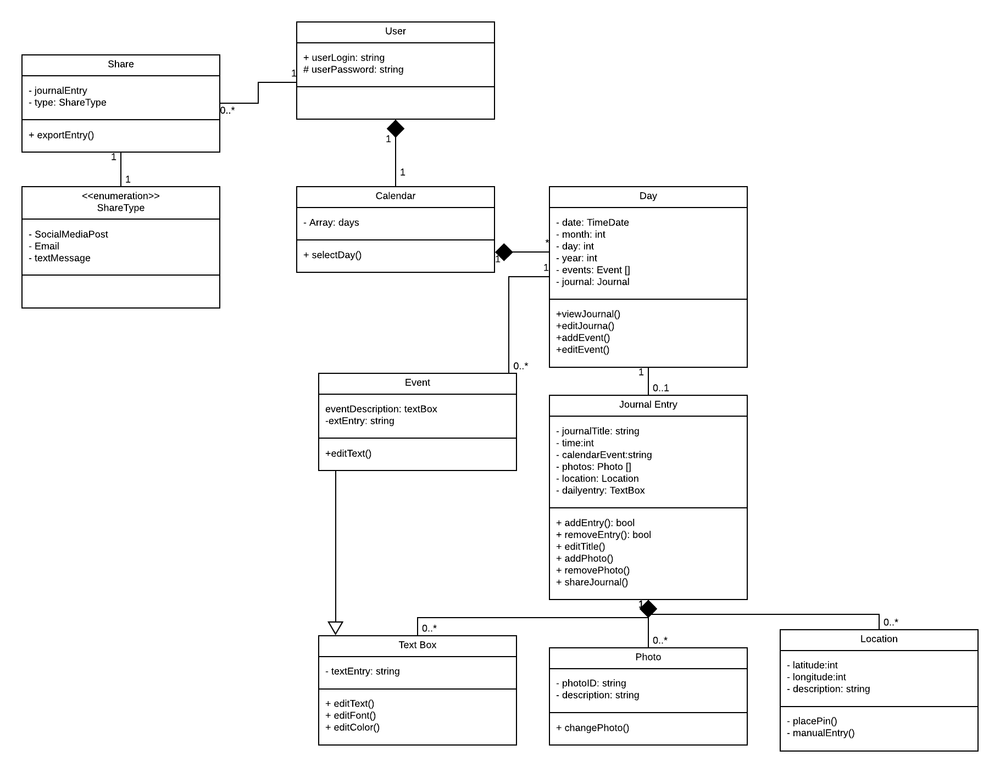

# D3. Analysis

Results of the software analysis for Journal Time.

## 1. System Description

Our memories can be greatly enhanced by including more context and information within our personal journals.  Currently, adding information beyond written entries requires significant effort by the individual, and a simple journal misses out on so much content, data, and other available information that is available on a smartphone.  For people who appreciate logging experiences from their day, Journal Time is a mobile app that helps users create enhanced personal journal entries that better capture and preserve their most important memories.  Journal Time allows users to add customized information, such as photos, social media posts, and news stories, from their smartphone or from their internet accounts to their daily journal entries.  This information is then organized in an attractive digital layout that can be utilized and shared in different manners.  

The key requirements for Journal Time begin with the need for a **calendar display** that allows the user to select an appropriate **day** to <ins>view or edit</ins> that **journal entry**.  Each **journal entry** will contain a **journal text box** where the user can <ins>enter and edit</ins> their own *text*.  Below the **journal text box** the user will have the ability to include additional enhanced information to that journal entry.  In one **section**, the user can select **photos** from their camera roll to <ins>include</ins> in the journal entry that will also include information on the photo such as *time* and *location*.  Another section will <ins>display</ins> of **events** from the users calendar (**calendar events**) or events that the user <ins>manually enters</ins> (**manual events**).  The app will also allow the user to add any **locations** they wish to and <ins>post</ins> an **image of these locations** on a map.    

## 2. Model

## 3. Class Responsibilities

**Calendar**: A Calendar class displays the days and is essential for User navigation to different Days so they can to create, edit, or view a journal entry.

**Day**: A Day represents an actual day and corresponds to a journal entry for that specific day. Days will be the primary manner in which we organize the journal entries.

**User**: A User class represents the specific user of the app and is necessary from a login and permission perspective so that their journal entries can be updated, saved, and kept secure.

**Share**: The Share class supports the users ability to share journal entries by defining what will be shared.

**ShareType**: ShareType indicates the manner in which the user plans to share a journal entry.  For example: email or text message.

**JournalEntry**: The class for each specific Journal Entry. The JournalEntry will be aligned to a specific Day and will contain and help display other objects such as a TextBox and Photo objects.

**Event**: Indicates a class that describes specific events during a day such as a birthday, holiday, or activity.

**TextBox**: Text objects used within the JournalEntry. This is essential as it is the basis of a journal entry, where users will type in the journals content.

**Photo**: A photo that would be included in the Journal Entry.  

**Location**: Location objects will keep track of specific longitude and latitude coordinates that can be used to map the users location at the time that each entry is written.  
