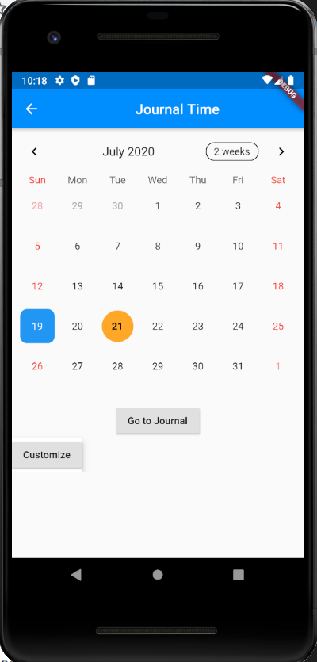
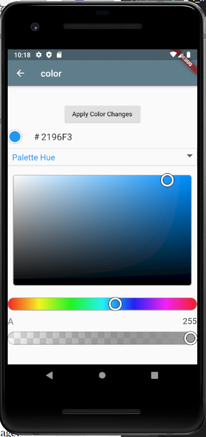
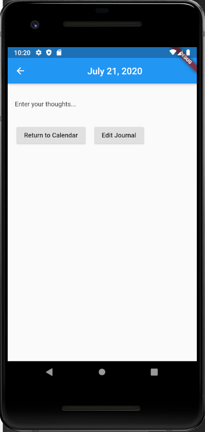
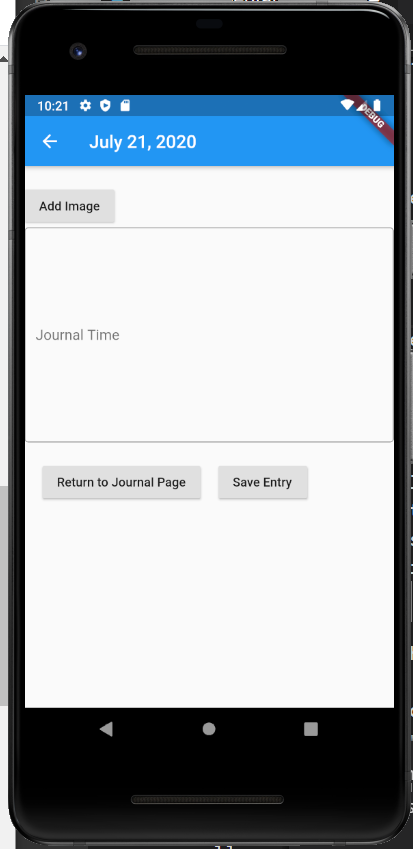
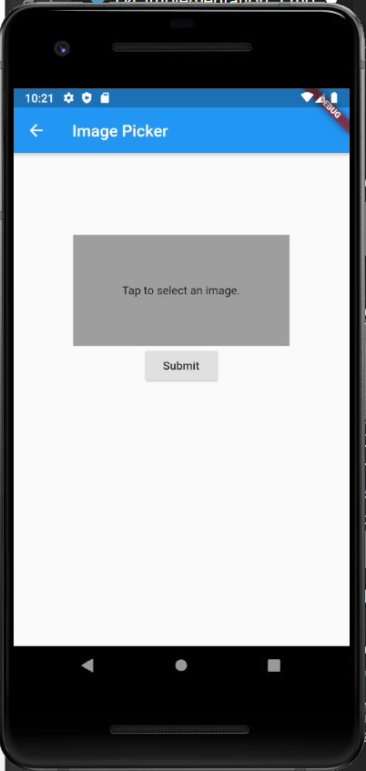

# D4. Implementation 1

## 1. Introduction

Journal Time is a mobile application that allows users to write personalized journal entries. Journal Time helps users create enhanced personal journal entries that better capture and preserve their most important memories unlike any other journaling or note-taking app, allowing its users to add customized information like photos locations, and news stories.

With Journal Time, users can create journal entries by going into a calendar and selecting their desired day to journal. From here, the journal-taker uses a text box to type in their entry, customize the text color and font for their entry, enter photos from their camera roll, and list their location at the time of writing.

GitHub: https://github.com/CS386-journal-time
Trello: https://trello.com/b/ckpVrn78/team3-journal-time

## 2. Implemented requirements

We have made prototype developments of the following features that show basic function and proof of concept.  The application will be enhanced in the near future as more of the backend data management systems are implemented.

* **Calendar Display** (Brendan, David))

* **Basic Navigation** (Seth, Brendan, Shelby)

* **Text Box for a Journal Entry** (Brendan)

* **Ability to select a photo from the smartphone** (Seth)

* **Basic Color Customization** (David)

* **Google Map Location Identifier** (Shelby)

* **AWS and Docker Set Up** (Seth, Keil)

## 3. Adopted technologies

**Flutter SDK with Dart programming language on Android Studio platform.**  Flutter / Dart was developed to allow the creation of mobile apps that work on both Android and iOS with limited to no customization required.  Flutter was the obvious choice for the SDK from a technical perspective and several team members had experience with Android Studio.

**Flutter Packages** table_calendar, flutter_hsvcolor_picker, and image_picker have been implemented to support Calendar and Photo operations

**Google API** Used to help identify Map location (in-development)

**Mobile Device Standards** Our primary testing will be done on a Nexus 6 virtual device.  However, with the nature of Flutter, we will also be doing secondary testing on other virtual devices and physical devices including at least one Android tablet.

**Amazon Web Service** Linux Server for hosting on application (in-development)

**Firebase** Mobile and web application development platform for backend operation (in-development)

**Docker** For project application deployment

## 4. Learning/training

Different members of the team have different levels of skill and background with different technologies.  Given the short timelines of the class project, we have decided to initially divide tasks based on team member background.  In the early stages it is expected that leads will provide assistance and learning materials to the team stages as well as oversee successful implementation.  As the project develops we have started shifting responsibilities so that each member of the team can gain broader exposure to the different technologies.  

Because the entire team is relatively new to Flutter, we have all had to depend on various internet and YouTube lessons to gain insights on various features.

From a backend and data perspective. We have been educating ourselves on Android Web Services and Google's Firestore which we will need deploy through Docker.  Select team members have been more engaged around Docker and AWS while others have been focused on implementing Firestore with Flutter.

## 5. Deployment

Our plan is to use a Firebase backend hosted within a Docker container on a cloud AWS server.  We were unable to finish the setup by this implementation, but linked below is the documentation for Firebase.  Firebase was created by Google along with Flutter making them mesh together well and provide a seamless user experience.

* Firebase documentation: <https://firebase.google.com/docs>

## 6. Licensing

This source code will utilize an MIT License. This is an ideal license for this project as its only conditions are in requiring preservation of copyright and license notices, and it is a generally simple and permissive license. This license allows for commercial use, distribution, modification, and public use. Therefore, all of our plans involving Journal Time, for code modification, usage, and distribution, will be permissable under this license.

## 7. Readme File

READ_ME.md file added along with CODE_OF_CONDUCT.md, CONTRIBUTING.md, and LICENSE.md

## 8. Look & feel

For Implementation 1, we decided to keep things clean from UI perspective, focus on functionality, and lay the foundation for customization.  Much of the display is based on the design of Flutter and the use of different Widgets and Packages to build the app display.  The calendar display is provided by table_calendar and has been well designed for mobile application use. The team wants to ensure that the user can customize their journal, and we feel that themes and colors are an important component of that.  We added the ability to customize the color with a cool package called flutter_hsvcolor_picker.

<<<<<<< HEAD

=======

>>>>>>> f06eb60f2ef5ce1a5422329e9eeaf3dda2e18a90

## 9. Lessons learned

As we move into the design phase of this application, we have noticed how helpful certain Flutter packages can be in our our implementation and how they can change certain dynamics of our class designs.  For example, the table_calendar application creates a calendar that is so useful that we will to redesign our Day class.  

Implementing a UI while also building out the backend is challenging.  There are a number of new technologies that we are all trying to learn and being strategic about how to deploy and integrate the various technologies.  

One of the biggest challenges of this deliverable is the pace at which we had to develop a working application as well as complete other project checkpoints and deliverables.  The team was very effective in using the weekend to make progress on the Journal Time application within Flutter.  And we see that we will need to keep that pace.  Furthermore, not being able to interact in person also creates challenges as it is a little harder to troubleshoot or complete certain deliverables in subgroups.  

## 10. Demo

