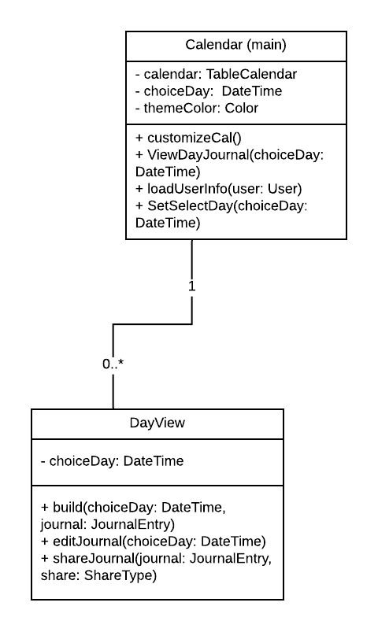

# D.5 Design

## 1. Description

Journal Time is a journal-taking mobile application that integrates information, such as photos, locations, and contacts into entries to provide context. The users of this application can avoid leaving out important information in their entries by providing contextual information already within their phone and the internet. When using Journal Time, the user will log into their account and view a calendar where they can select the date that they would like to make an entry for. From here, the user can type their entry into a text box, customizing the font and color of their text as well as the background of the overall entry.

Users can also enter photos from their camera or camera roll into entries, as well as their location. Their entry will be saved to their account through the server where they can later access and edit it through their phone or another device. Users also get the chance to share what is going on in their lives through sharing their entries. Users can either email or text PDF versions of their entries to any friends or family they would like.

## 2. Architecture

We've chosen a server/ client architecture with a focus on local storage. D5 Implentation Diagram.

## 3. Class Diagram

As we develop insights into our implementation, we are able to provide updated class diagram that shows the interactions between the various classes.

## 4. Sequence Diagram

### Use Case: Importing a photo

### Description

* The user can import a photo into their entry.

### Actor

* User

### Pre-conditions

* The user has opened the app to the home screen (calendar view).

## Basic Flow of Events and Alternative Flows

1. User views a day's journal

2. User edits a journal entry

3. User chooses direction for photo importation

   3.1 User selects a photo from the gallery

   3.2 User takes a photo with the camera

   3.3 User cancels the import

4. User saves the entry

5. User returns to the calendar view

### Post-conditions

* The image is successfully added to the entry.

## 5. Design Patterns

**Observer Design Pattern.  Passing the Selected Date (or choiceDay) to other entities.**

Within the Journal Time application, journal entries and their components will be organized based on the associated date (or choiceDay).  It will act effectively as a key to backend operations so that we can properly save and build the components of a Journal Entry.  Accordingly, the choiceDay will have to be provided throughout the program from class to class starting with the Calendar class.  

Our current design is no pass the choiceDay: DateTime parameter with each navigation.  However, we are also considering implementing an Observer Design Pattern that would allow the different classes to be notified and updated when there is a change to the choiceDay.  Our project is being built with Flutter, and it has some cool tools to help developers manage states and data across screens and classes.  One of those is from a package called Provider that utilizes Change Notifiers and Providers to update data and state across different classes.  As we build out our application design, we are determining where it makes the most sense to use Change Notifiers and where to simply pass the choiceDay as a Parameter in navigation.  For a simple application , just passing the choiceDay in navigation would probably suffice but as we add features and functionality, an Observe Design Pattern may become more relevant.  

Calendar: 	https://github.com/CS386-journal-time/CS386-journal-time/blob/master/journal_time/lib/main.dart

Day: 	https://github.com/CS386-journal-time/CS386-journal-time/blob/master/journal_time/lib/Day.dart

### Creational Desing Pattern Build Design Pattern

JournalEntry is a Builder pattern.  The journalEntry Class provides the groundwork for the three peices necessary for the complete journal entry itself.  The the Photo, JournalText, and MapLocation classes retrieve the relative data and the JournalEntry class interprest each classes data to form the class itself.

The current design for incorporates the JournalEntry class as the home for all the data relative to the entry for the given day.  

JournalEntry: <https://github.com/CS386-journal-time/CS386-journal-time/blob/master/journal_time/lib/JournalEntry.dart>

## 6. Design Principles

The Acronym SOLID stands for S - Single responsibility principle, O - Open/closed principle, L - Liskov substitution principle, I - Interface Segregation Principle, and D - Dependency Inversion Principle.

S - Single Responsibility principle
This principle states that every class should manage or have responsibility over a single part of the softwares functionality. For example in the journal time app there is one class for photo integration, customization and journaling. While they may pass some information back and forth each class is focused on one feature. To be more specific the photo Class photo journal_time1/lib/Photo.dart
found : (https://github.com/CS386-journal-time/CS386-journal-time.git)
Focuses only on photo integration.

O - Open/Closed principle
The Open/Closed principle states that you should be able to add on or extend a classes behavior rather than modify it. One example from our code would be the customColor class which currently only modifies background color if we in the future we want to also allow the user to modify the color of their calendar we could define a class calanderColorChanger that implements customColor. In this way we won't have to touch existing modules.
journal_time/lib/customColor.dart
Found: (https://github.com/CS386-journal-time/CS386-journal-time.git )

L - Liskov substitution principle
To put this  principle simply you must be able to substitute the parent class for one of its children.

I - Interface Segregation Principle
This principle states that no client should have to depend on methods that they do not use. You should split your interface into smaller more specific groups.

D - Dependency Inversion Principle.
There are two main parts of this principle. First your high level modules shouldnt be dependent on any low-level modules however both should depend on interfaces/ abstractions. The second is that your abstractions shouldn't depend on Details.
