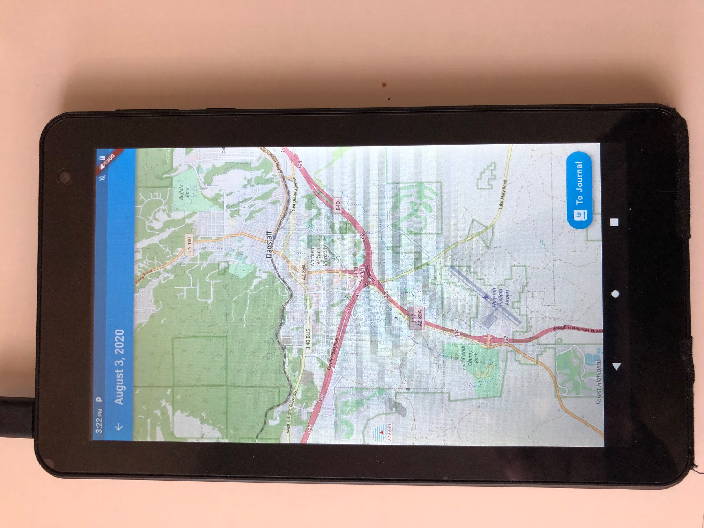

# D7 Verification and Validation

## 1. Description

Journal Time is a journal-taking mobile application that integrates information, such as photos, locations, and contacts into entries to provide context. The users of this application can avoid leaving out important information in their entries by providing contextual information already within their phone and the internet. When using Journal Time, the user will log into their account and view a calendar where they can select the date that they would like to make an entry for. From here, the user can type their entry into a text box, customizing the font and color of their text as well as the background of the overall entry.

Users can also enter photos from their camera or camera roll into entries, as well as their location. Their entry will be saved to their account through the server where they can later access and edit it through their phone or another device. Users also get the chance to share what is going on in their lives through sharing their entries. Users can either email or text PDF versions of their entries to any friends or family they would like.

## 2. Verification (tests)

### 2.1 Unit Test

#### 2.1.1 Chosen test package

Test by Dart.dev (the developers of dart): [Test Package](https://pub.dev/packages/test)

#### 2.1.2 Link to our test package

TBA

#### 2.1.3 Example test case

An example test case would be the verification of the user correctly being created from the user model class.

#### 2.1.4 Print screen of unit test execution

TBA

### 2.2 Integration Test

**Integration Test: Save to Database**
We want to show that data was successfully stored in the database after the user enters it.  Given our application and database design within Flutter, it was challenging to implement automated integration testing.  

Below the User enters text to be saved.

Database view of the added information after a save.

**Integeration Test: Color Change**

In this test we want to show that colors were successfully passed to the material app to be distributed as a theme across the whole app. This test would be a white box test as the tester knows the input and inside of the app and knows what to expect for output. However due to our apps design we will only walk through how the test would have been implemented.

Below the User starts in the personalization screen of the app before selecting new colors.

 

Next the user selects a background color and a canvas color
 
 

 

Those colors are passed back to the personalization screen as shown below. This allows the user to preview their colors before submitting changes.

 

 
Finally once the user hits submit  the changes are sent to the rest of the app.

Calendar with updated color:
 
 

Journal page with updated color:

Journal edit page with updated color:

### 2.3 Acceptance

For our Acceptance Testing our tests are very hands on and require a user to manually determine if the goal is achieved.  Accordingly, we did not use a test framework in the following tests.

**Acceptance Test 1:** Create a journal entry on one device and view it on another device (Test Successful)

User Logs into a handheld Android tablet and creates a Journal Entry for August 3, 2020.

User Logs into a Virtual Android Device to view August 3, 2020 Journal Entry.  Journal Entry appears and the test is successful.  

**Acceptance Test 2:** Confirm that App identifies my correct location. (Test Successful)

Current Location: Flagstaff, AZ

Initial Test on an Android Phone Simulator:

Within Simulator Map Displays Mountain View, CA which is home to Google, the makers of Android OS.  This is not what is desired but is logical given the simulators location.  We need to retest with an actual Android device.  Test is successful and this confirms that location finder can identify different locations.

## 3. Validation (user evaluation)

### Script

Tasks:

1. User creates an account
2. User selects the drawer and selects "Personalize Color"
3. User follows prompts to select new colors, saves, and returns to Calendar page with new color scheme.
4. User selects a day and then selects "Edit" from the empty Journal entry
5. User enters text, a photo, and sees current weather in current location.  User selects save.
6. User sees this information within the current Journal Entry.
7. User selects "View Map" within Journal Entry to see their current location on a map.  
8. User returns to Journal Entry and then returns to "Home" and the Calendar page.
9. User selects sign out.  

### Results

**Interview 1: John Hilley** Previously interviewed as part of Inception.

Takeaways:

- Impressed by functionality within the MVP and sees lots of potential to expand with other features.
- It meets desired expectations.  
- He has a desire to type entries on a computer keyboard and not text (expand to web)
- Liked the automation aspects like weather and phone, and saw potential to automate more features within a finished product.
- Customization has good potential and he liked the crazy color schemes that you could create.  He also thought that you could automate different aspects of design like time of day / season.  

**Interview 2: Maddie Burchfield** Previously interviewed as part of Inception.

Takeaways:

- Liked the functionality presented.
- Thought the app was easy to use and navigate.
- Enjoyed customizing the app with different colors.
- Had some ideas about new features for the map, such as navigation.
- Would like to see an option to share her entry.

### Reflections

Journal Time seems to offer a desired functionality to those who are interested in an enhanced journal experience.  As we finalize the MVP, we see great value with a flexible backend as it will allow our development teams to add on new features.  Furthermore, the flexibility can allow users to take advantage of some features and not others.  There is also great value in automation.  We just scratched the surface with the Maps and the Weather, but Journal Time could generate a plethora of valuable user context and information with limited effort from the user.  Finally, the user interface and the ability to customize colors, fonts, themes, and graphics is critical to a well received final product.  How we display the information is just as important as the information that we collect.  
